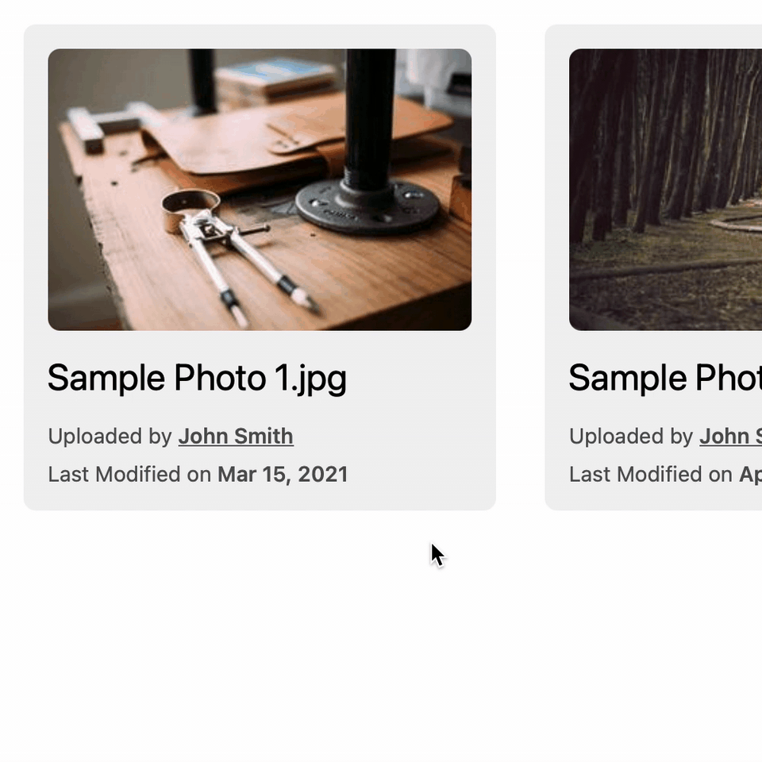
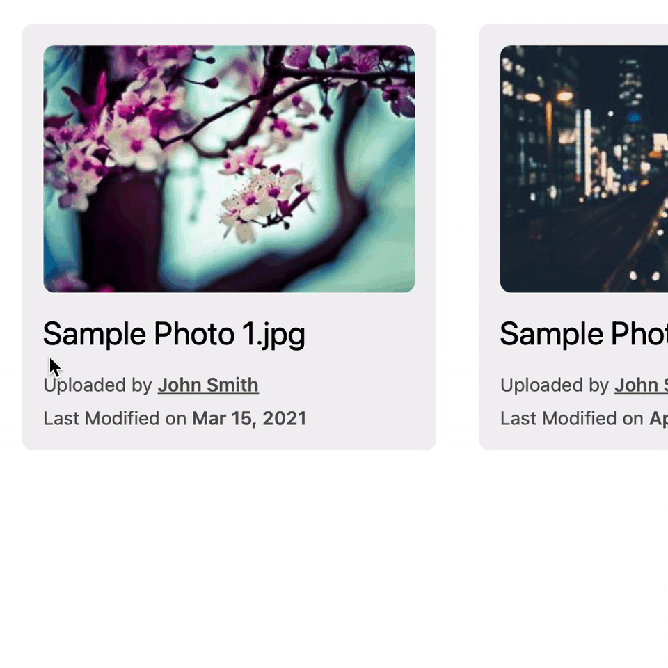

# A Custom Context Menu That Respects Default

フロントエンドに実装された独自のコンテキストメニューと、デフォルトの挙動であるブラウザのコンテキストメニューとを共存します。1回の右クリックでは独自のコンテキストメニューが表示されますが、2回続けて右クリック（ダブル右クリック）することでブラウザのコンテキストメニューにもアクセスできます。

## Motivation

独自のコンテキストメニューを表示するには、`contextmenu` イベントをトリガーとし、かつ `event.preventDefault()` でブラウザのコンテキストメニューが表示されないようにする必要があります。しかし、この状態ではブラウザのコンテキストメニューにアクセスする手段を失います。例えば、独自のコンテキストメニューが表示される領域内にあるテキストをクリップボードにコピーしようとしてもできなくなります。

クリップボードへのコピーであればキーボードショートカットなどからでもできますが、ブラウザ（や OS）がコンテキストメニューを用意しており、普段はブラウザのコンテキストメニューを利用できることから形成されるユーザの習慣を考慮すると、これは望ましくありません。さらには、ブラウザのコンテキストメニューにはブラウザや OS 独自の項目が含まれることもあります。例えば、Chrome では「Google で（選択されたテキスト）を検索」というアクションが用意されています。

最近はネイティブアプリ並みのリッチな Web アプリが多く、上記の画像のような独自のコンテキストメニューはユーザにとって操作性の向上につながるでしょう。しかし、ユーザはあくまでアプリが Web ブラウザ上で動いていると認識し、それに基づいた習慣を持っていると考えられます。そこで、独自のコンテキストメニューとブラウザのコンテキストメニューのどちらも利用できるようにし、ユーザの習慣を阻害しないようなユーザインタフェースの実装を試みました。

## Why Double-Right-Click?

設計にあたっては YouTube の動画のコンテキストメニューを参考にしました。YouTube では、動画上で右クリックすると YouTube 独自のコンテキストメニューが表示されます。この状態でさらに右クリックすると、ブラウザのコンテキストメニュー（この場合は HTML5 動画に対する操作の一覧）が表示されます。

しかし、今回の実装では、冒頭の画像のように、ブラウザのコンテキストメニューにアクセスする操作としてダブル右クリックを採用しました。これは、同じ（1回の）右クリックという操作でモードエラーが生じるのを避けるためです。コンテキストメニューはユーザインタフェースにおいて一回限りのモード（one-off mode）を作りますが、独自のコンテキストメニューに加えてブラウザのコンテキストメニューへのアクセスも用意すると、モードの遷移が一つ増えてしまいます。

1. コンテキストメニューが開かれていないモード
2. 独自のコンテキストメニューが開かれているモード
3. ブラウザのコンテキストメニューが開かれているモード

YouTube のような仕組みでは、右クリックという操作の結果が、現在の状態が 1 にあるか 2 にあるかで異なってしまいます。これは**モードエラー**を引き起こす原因になります（詳細は、ジェフ・ラスキン著『ヒューメイン・インタフェース』を参照してください）。

そこで、現在の状態に関わらず常に同じ操作結果を返すために、ブラウザのコンテキストメニューが開かれているモードへの遷移方法をダブル右クリック（右クリックした直後にもう一度右クリックする）としました。ダブルクリックは2回クリックを行いますが、クリックが連続することで意味上は一つの操作とみなすことができます。これにより、1 → 2 → 3 の遷移ではなく 1 → 2、1 → 3 の遷移ができるようになり、操作と結果を一対一にすることができます。現在の状態により操作結果が変わらなくなるため、モードエラーを抑制できます。

## Implementation

実装内容については [`index.html`](index.html) のソースコードを参照してください。重要な箇所、意図が読み取りづらいと思われる箇所にはコメントを記述しています。

## License

See [LICENSE](../LICENSE).
