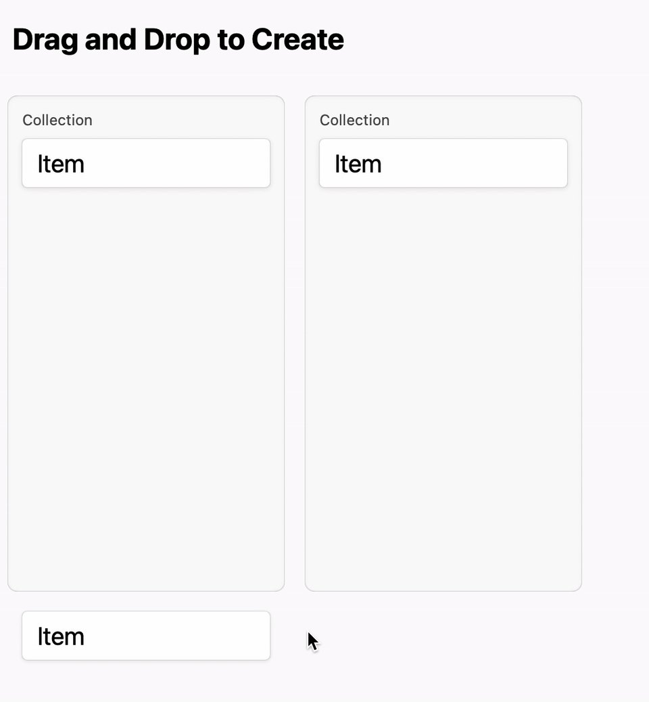

# Drag and Drop to Create

Create a new object from its class object.

ドラッグアンドドロップで任意のコレクション内にオブジェクトを作成します。



## Features

グラフィカルユーザインタフェースで新規のオブジェクトを作成する方法はいくつかあります。例えば、コレクション内にツールバーを用意してそこに作成ボタンを置くものや、コレクション内に永続化されていない空の要素オブジェクトを配置しそれをクリックすることで作成できるものがあります。

この方法はそれらと比較して次のような特徴があります。

### In a One-Off Mode

オブジェクトを作成する操作と作成先を指定する操作を一回限りのモードで実行できます。先に作成コマンドを実行し、次に作成先を選択するコマンドを実行するという流れだとモーダルな操作になり、モードエラーを誘発します。

ただし、コレクションごとに作成ボタンを置くことで、作成先を選択する操作を暗黙的に実行することもできます。どのコレクション内の作成ボタンをクリックするかという選択が作成先の選択と等しく、そこにモードは生じません。

### Faithful to the Syntax of Natural Language

ドラッグしているものをクラス（クラスもまたオブジェクト）だと考えると、まさにクラスからインスタンスを生成している動作に見えます。さらに、ドロップする先によって作成先のコレクションを引数で指定できます。これは、オブジェクト指向言語の構文と自然言語の構文に忠実です。例えばRubyでは次のように記述できます。

```rb
Item.create to: collection
# Create a item to the collection.

# More strict but verbose?
Item.create appendTo: collection
# Create a item and append it to the collection.
```

コレクション内に作成ボタンを配置するインタフェースでは、この解釈が曖昧になります。コレクション内にある永続化されていない空の要素オブジェクトを暗黙的に選択していると考えれば先ほどの構文になりますが、コレクションに対する操作だと考えると、コレクションを新規作成するという解釈も考えられ、それは意図した操作ではありません。意図した操作に解釈したとしても、自然言語の構文とは矛盾します。

```rb
collection.create Item.new
# Create the collection with a new item? No.

collection.createTo Item.new
# Create to the collection..., no. Create a new item to the collection.
```

## See Also

https://twitter.com/kazuhiro2nd/status/1454280785624649733

## License

See [LICENSE](../LICENSE).
