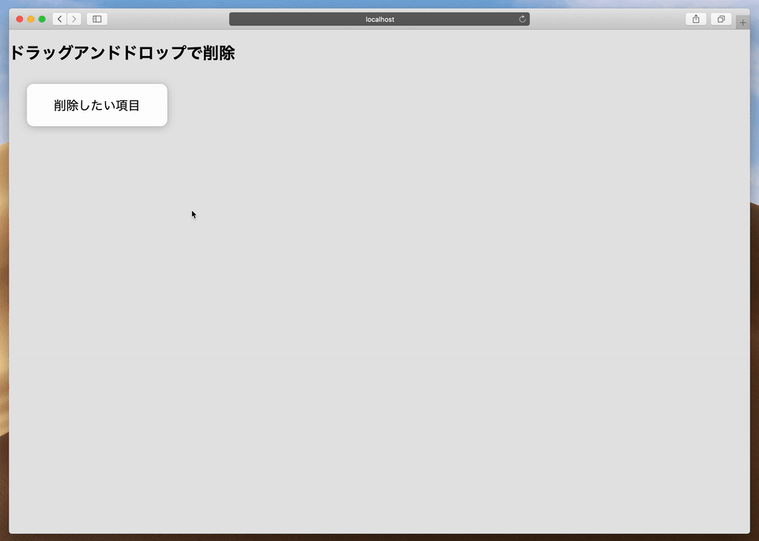

# Deleting Objects with Drag and Drop

Direct manipulation to delete objects on web applications.

ドラッグ開始時に削除するためのドロップ領域を表示することで、OS 上でファイルをゴミ箱にドラッグアンドドロップして削除するのと同じような感覚を Web アプリケーション上で実現します。

## See Also

[Drag and drop to delete by Valentin Salmon for Évolt on Dribbble](https://dribbble.com/shots/4613529-Drag-and-drop-to-delete)

## License

See [LICENSE](../LICENSE).
