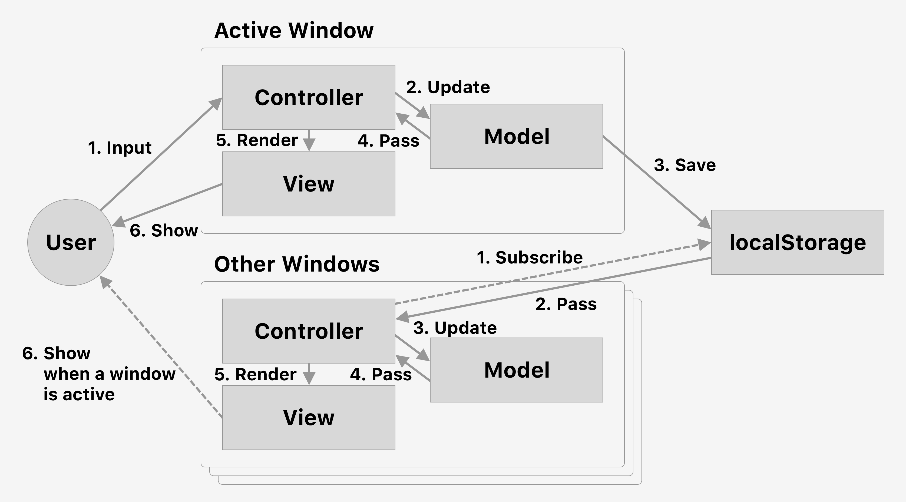

# Communication Between Windows with `localStorage`

A window sends a message to other windows with `localStorage`.

`localStorage` を用いて、あるウインドウから別のウインドウへメッセージを送信することで、ウインドウ間でデータを同期します。

## データの流れ

アクティブなウインドウでユーザの入力をドキュメント（ウインドウ）内のモデルに保存し、それを `localStorage` にも保存します。

一方、それ以外の非アクティブな各ウインドウで `localStorage` を購読しておき、変更を検知したら（`storage` イベント）それを自身のドキュメント内のモデルにも反映します。

このようにしてウインドウ間でデータを同期することが可能になります。

## 注意事項

Safari ではプライベートブラウジング中に `localStorage` を使うことができません。

## 起動方法

このディレクトリをルートとして Web サーバを起動してください。Chrome の場合は拡張機能 [Web Server for Chrome](https://chrome.google.com/webstore/detail/web-server-for-chrome/ofhbbkphhbklhfoeikjpcbhemlocgigb) がおすすめです。

## License

See [LICENSE](../LICENSE).
